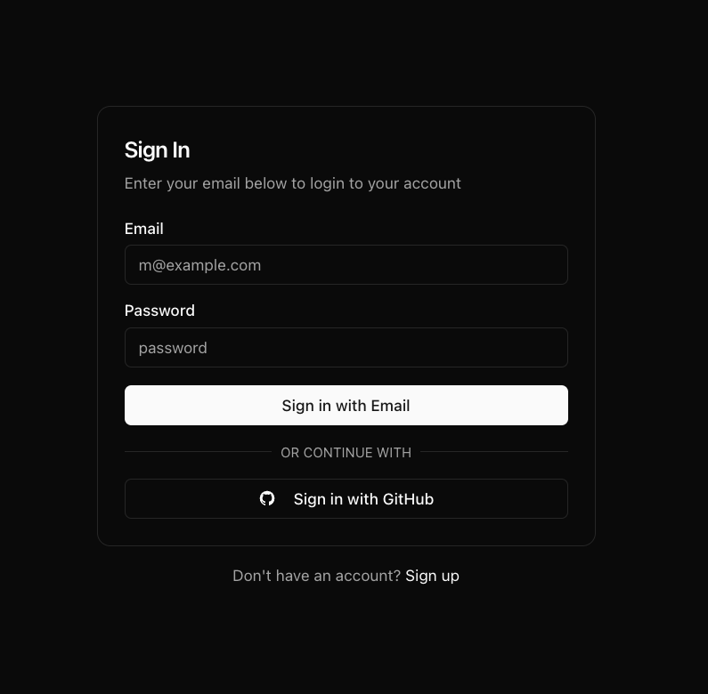
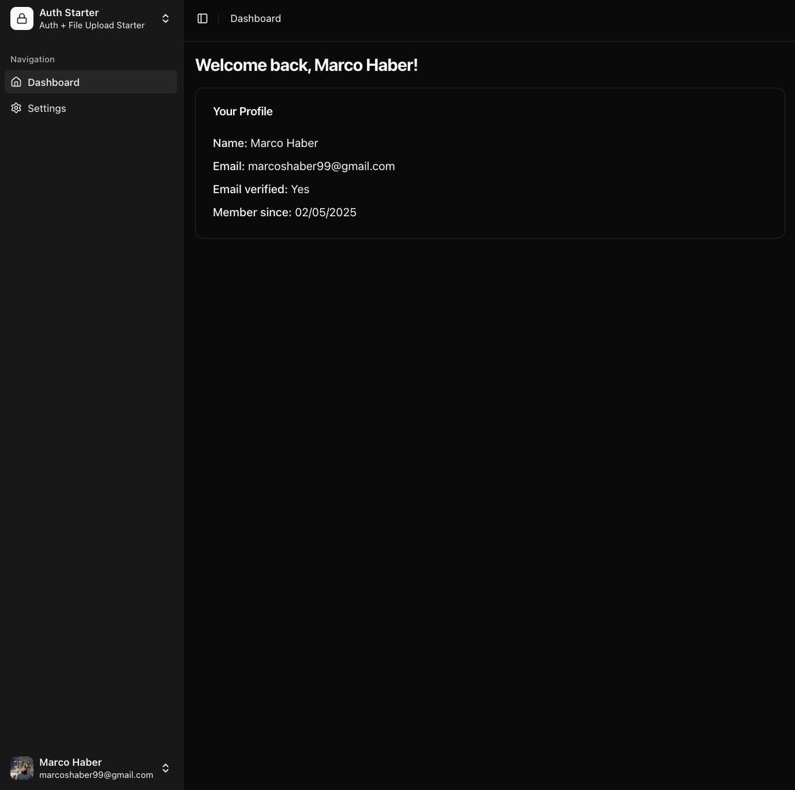

# Auth Files Starter

A modern, full-stack starter template for authentication and file upload functionality with Next.js.

## Features ( so far )

- 🔐 Authentication with email/password and GitHub
- ✉️ Email verification with OTP
- 🎨 Dark mode
- 📱 Collapsible sidebar w/ Shadcn/ui
- 📊 Dashboard

## Stack

- Next.js 15 (App Router)
- Better-Auth
- Drizzle + PostgreSQL
- React Email + Resend
- Shadcn/ui + Tailwind
- UploadThing (coming soon)

## Progress

- [x] Email/Password Auth
- [x] Email Verification OTP
- [x] GitHub Auth
- [x] Simple Dashboard w/ Collapsible Sidebar (Shadcn)
- [ ] File Uploads with UploadThing

## Setup

```bash
# Install dependencies
npm install

# Copy environment variables
cp .env.example .env

# Start development server
npm run dev
```

## Environment Variables

```env
BETTER_AUTH_SECRET=
BETTER_AUTH_URL=
NEXT_PUBLIC_APP_URL=
DATABASE_URL=
RESEND_API_KEY=
EMAIL_FROM_ADDRESS=
EMAIL_FROM_NAME=
GITHUB_CLIENT_ID=
GITHUB_CLIENT_SECRET=
```

## Screenshots

<div style="display: flex; gap: 10px;">
  
  
</div>

## Contributing

Feel free to open issues and pull requests!

---

If you find this helpful, consider giving it a ⭐️
